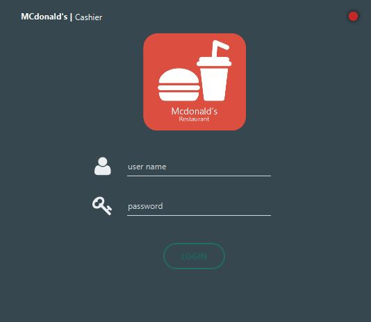
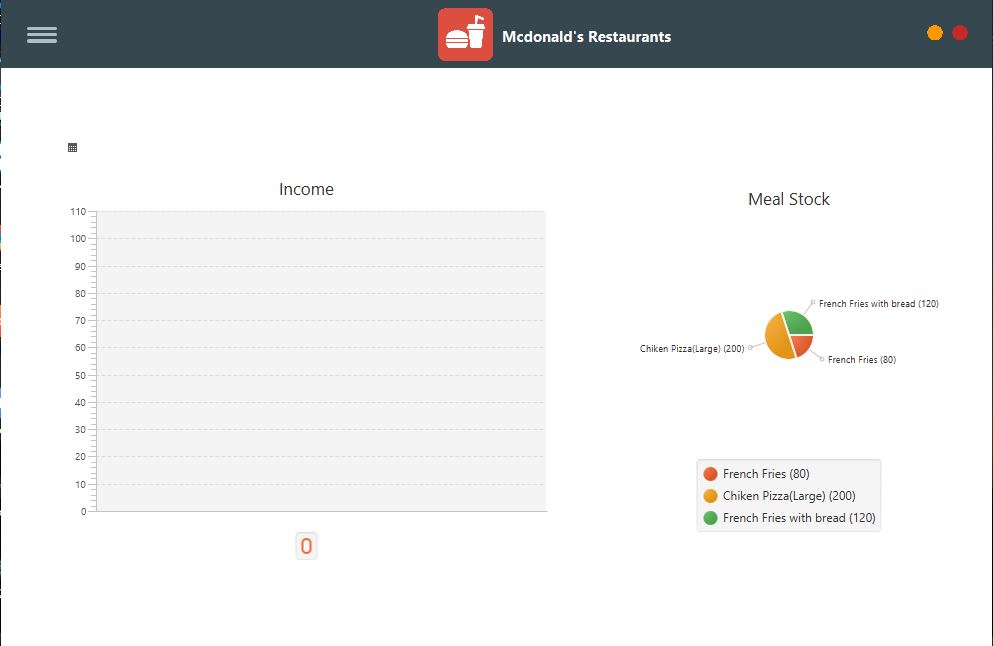
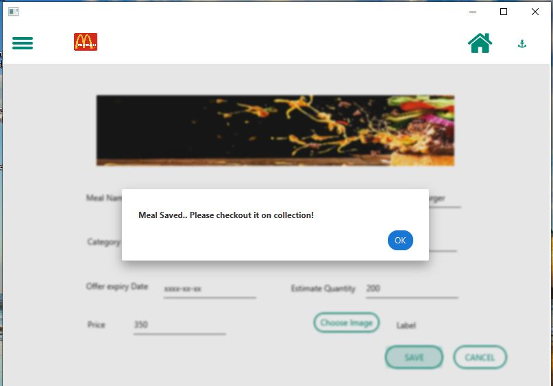
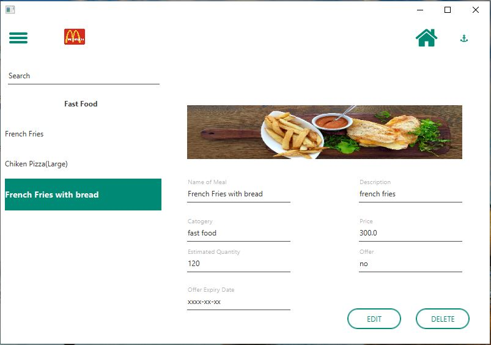
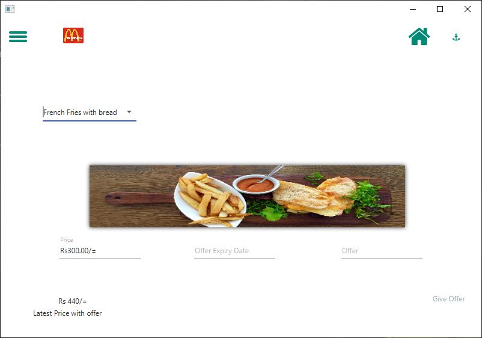
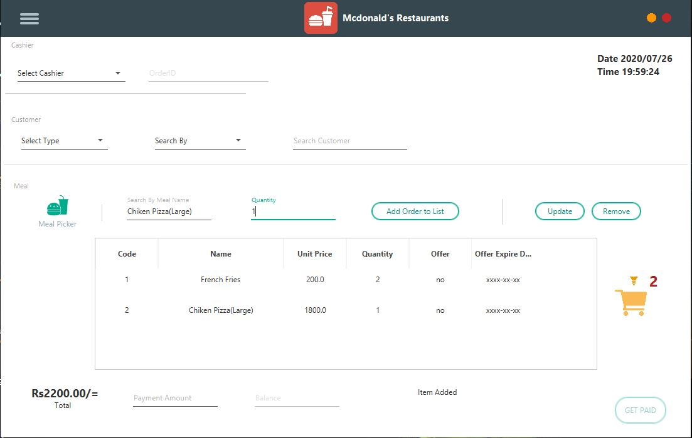
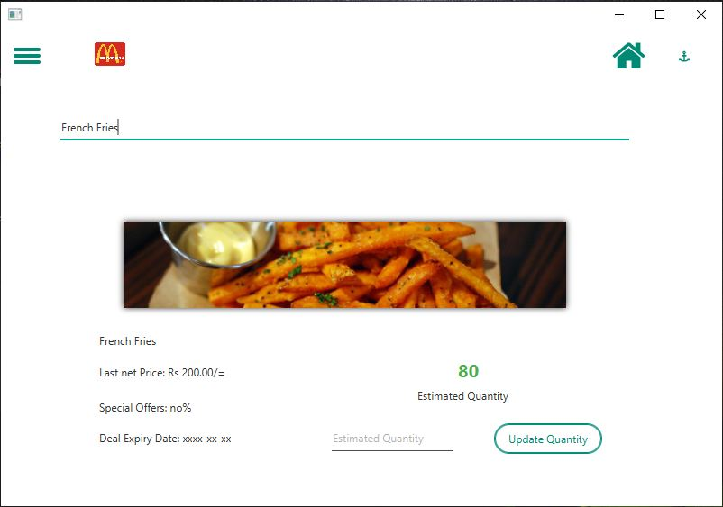

```
Project Name - MCDonalds-Restaurant-Management-System
Description -Java RMI Project with client-server Architecture
Tech Stack - Java,JavaFX,Hibernate, MySQL
```

<p align="center">
  
  
  
  
  
  
  
</p>


